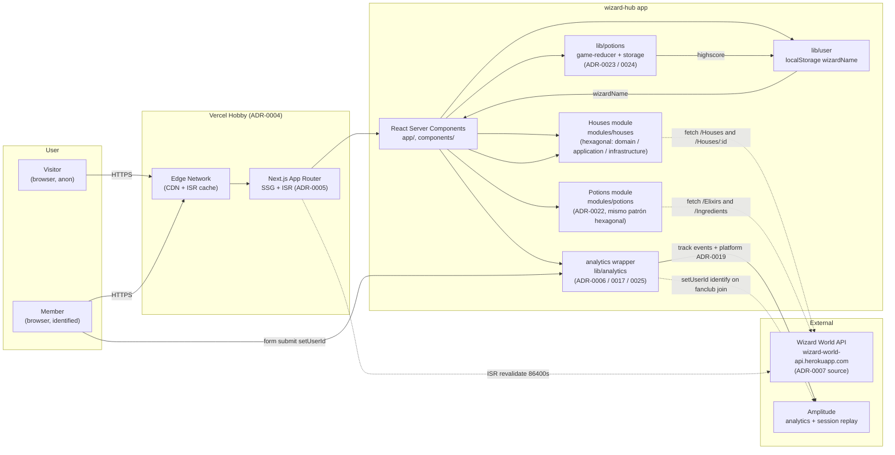

# HLD — wizard-hub

> High-Level Diagram: contexto del sistema y componentes principales.
> Cumple entregable HLD del challenge (ADR-0010).

## Vista de sistema

## Decisiones reflejadas

| Componente | Decisión |
|---|---|
| Hosting | Vercel Hobby — [ADR-0004](../adr/0004-deploy-vercel-hobby.md) |
| Data fetching | SSG home + ISR catálogo `revalidate: 86400` — [ADR-0005](../adr/0005-data-fetching-ssg-isr.md) |
| Estructura | App Router + módulos hexagonales (Houses, Potions) — [ADR-0009](../adr/0009-estructura-app-router-hexagonal-ddd.md), [ADR-0022](../adr/0022-modulo-potions-bounded-context.md) |
| Analytics | Wrapper propio sobre `@amplitude/unified` — [ADR-0006](../adr/0006-amplitude-wrapper-tipado.md), [ADR-0017](../adr/0017-migracion-amplitude-unified.md), [ADR-0025](../adr/0025-potions-events-taxonomy.md) |
| Lifecycle | Anónimo → conocido vía form — [ADR-0008](../adr/0008-user-lifecycle.md) |
| `platform` | Event property común a todos los eventos — [ADR-0019](../adr/0019-propiedad-platform-event-property.md) |

## Escala esperada

- App Hobby Vercel: 100 visits/día cómodo, ISR cachea Houses en edge.
- API externa (Heroku): puede dormirse tras inactividad → ISR suaviza el impacto.
- Amplitude free tier: cubre el volumen del challenge con margen.
