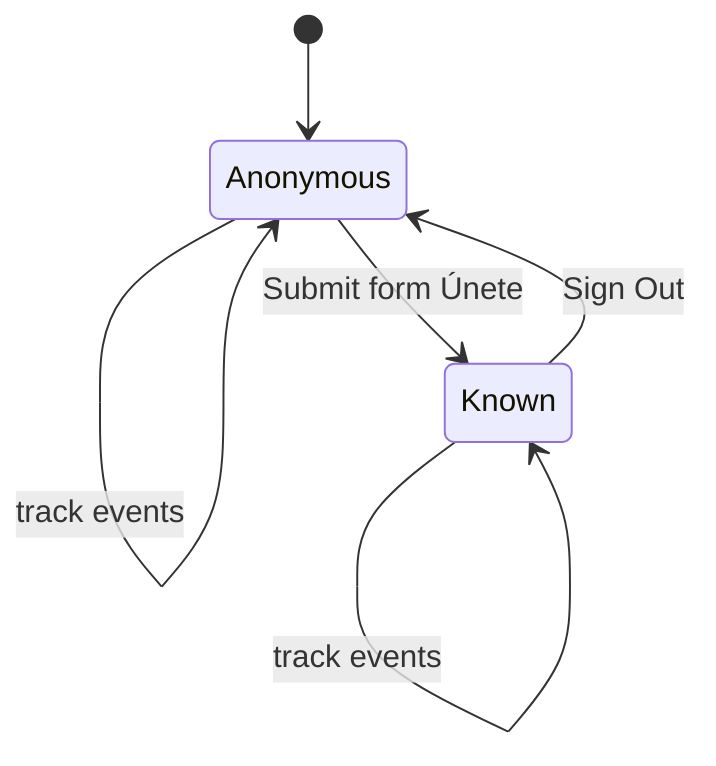
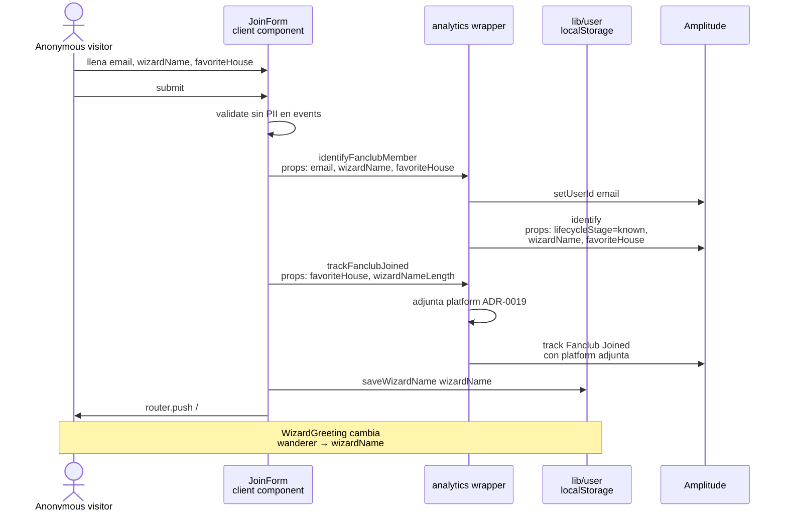

# LLD — Amplitude user lifecycle

> Diagrama del lifecycle anónimo → conocido (ADR-0008) y del catálogo de eventos/props en cada transición.
> Cumple entregable LLD del challenge (ADR-0010).

## State diagram

> Vista conceptual. La tabla de abajo lista los detalles técnicos (device_id, user properties, catálogo de eventos) y el sequence diagram muestra el flujo completo del submit.

## Sequence — Join flow

## Eventos y propiedades por estado

| Estado | Eventos posibles | User properties |
|---|---|---|
| **Anonymous** | Todos los del catálogo v1.1 (con `platform` adjunta) | `lifecycleStage: 'anonymous'` |
| **Known** | Todos los del catálogo v1.1 (con `platform` adjunta) | `lifecycleStage: 'known'`, `wizardName`, `favoriteHouse` |

> **Nota:** `preferredTheme` está planificado en [ADR-0007](../adr/0007-event-taxonomy.md)
> pero **no implementado** — `theme-toggle.tsx` solo persiste en `localStorage`
> (key `wizard-hub:theme`) sin llamar `identifyUserProperties(...)`. Pendiente
> como seguimiento.

## Catálogo v1.1 referenciado

| Evento | Cuándo | Props específicas |
|---|---|---|
| `Page Viewed` | Auto (SDK) | `path`, `title`, `referrer` |
| `House Viewed` | Mount en `/houses/[id]` | `houseId`, `houseName`, `houseFounder`, `source` |
| `House Card Clicked` | Click en card | `houseId`, `houseName`, `source` |
| `Explore CTA Clicked` | Click CTA explorar | `location` |
| `Back To Houses Clicked` | Click "volver" | `fromHouseId` |
| `External Link Clicked` | Click link externo | `target`, `location` |
| `Theme Toggled` | Toggle dark/light | `newTheme` |
| `Fanclub Joined` | Submit form | `favoriteHouse`, `wizardNameLength` |

**`platform`** (`web-desktop` \| `web-mobile` \| `web-tablet`) está adjunta automáticamente a **todos** los eventos vía wrapper — ver [ADR-0019](../adr/0019-propiedad-platform-event-property.md).

## Métricas del challenge soportadas

1. **Most viewed House (Unique Users)** — `House Viewed` agrupado por `houseName`, métrica uniques.
2. **All Houses Viewed by Platform (Event Totals)** — `House Viewed` agrupado por `platform`, métrica event totals.
