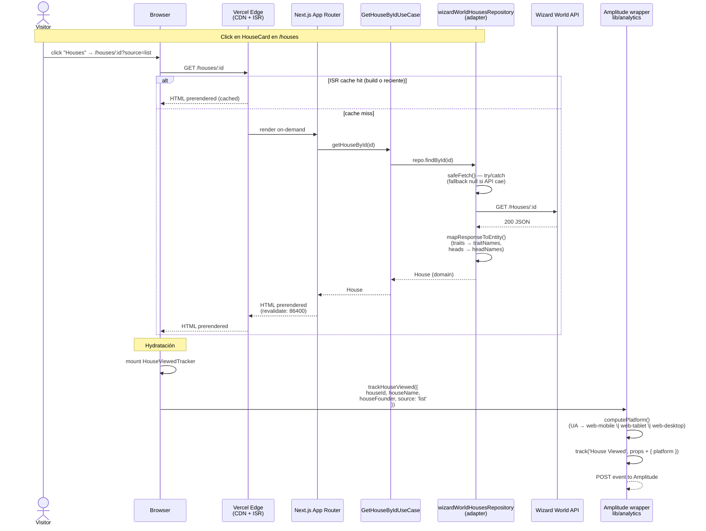

# LLD — House detail flow

> Diagrama de secuencia: request a `/houses/[id]` end-to-end (SSG/ISR → fetch API → hydratación → evento Amplitude).
> Cumple entregable LLD del challenge (ADR-0010).

## Flujo principal

## Componentes clave

| Capa | Archivo | Rol |
|---|---|---|
| Route | `app/houses/[id]/page.tsx` | Server Component, ISR, `generateStaticParams`, `generateMetadata`. |
| Use case | `modules/houses/application/get-house-by-id.usecase.ts` | Orquesta, no conoce HTTP. |
| Port | `modules/houses/domain/house-repository.port.ts` | Interfaz que define el contrato. |
| Adapter | `modules/houses/infrastructure/wizard-world-houses.repository.ts` | Llama API, mapea DTO → domain. |
| Tracker | `app/houses/[id]/house-viewed-tracker.tsx` | Client component, dispara `House Viewed` en mount. |
| Wrapper | `lib/analytics/client.ts` | Adjunta `platform` automáticamente a cada track. |

## Eventos Amplitude en este flujo

| Paso | Evento | Props |
|---|---|---|
| Click en card | `House Card Clicked` | `houseId`, `houseName`, `source` |
| Mount en detalle | `House Viewed` | `houseId`, `houseName`, `houseFounder`, `source`, **`platform`** (auto) |
| Click back | `Back To Houses Clicked` | `fromHouseId` |

## Notas

- `source` fluye como query param: `houses_list` → `list`, `home` → `home`, sin `?source=` → `direct`.
- La prop `platform` se adjunta en el wrapper sin que el call site la pase explícitamente ([ADR-0019](../adr/0019-propiedad-platform-event-property.md)).

## safeFetch — resiliencia ante API caída

El adapter `wizardWorldHousesRepository` envuelve el fetch en `safeFetch` que atrapa errores y devuelve `null` (o `[]` para `findAll`). Esto evita que un error de la Wizard World API (Heroku dormido, 5xx) rompa el build ISR — el fallback fluye a `notFound()` (404) o a la UI de empty state.

Refs: `modules/houses/infrastructure/wizard-world-houses.repository.ts:33-48`, `lib/api/wizard-world.client.ts`.

## mapResponseToEntity — proyección DTO → domain

| API response (`HouseResponse`) | House entity (domain) |
|---|---|
| `traits: [{ name: "Cunning" }]` | `traitNames: ["Cunning"]` |
| `heads: [{ firstName, lastName }]` | `headNames: ["Severus Snape"]` |
| `id`, `name`, `founder`, etc. | pass-through |
