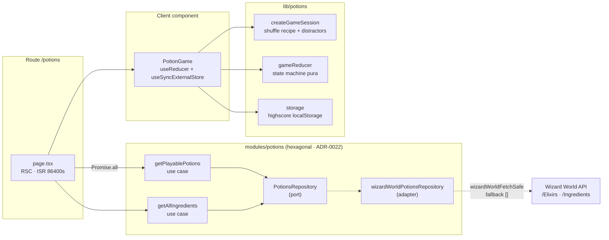

# LLD — Potions game flow

> Diagrama del flujo del juego de pociones: fetching ISR → fábrica de sesión → reducer → eventos Amplitude → persistencia de highscore.
> Cumple entregable LLD del challenge (ADR-0010). Reglas de diseño en [ADR-0023](../adr/0023-potions-game-design.md); fetching y distractors en [ADR-0024](../adr/0024-potions-fetching-distractors.md); eventos en [ADR-0025](../adr/0025-potions-events-taxonomy.md).

## Vista de componentes



## Sequence — partida completa (start → win)

```mermaid
sequenceDiagram
    actor U as Player
    participant B as Browser
    participant N as Next.js App Router
    participant UC as Potions use cases
    participant A as Wizard World API
    participant UI as PotionGame<br/>client component
    participant S as createGameSession
    participant R as gameReducer
    participant ST as storage<br/>localStorage
    participant AM as Amplitude wrapper

    Note over U,N: Carga inicial /potions (ISR)
    U->>B: GET /potions
    B->>N: render
    N->>UC: getPlayablePotions + getAllIngredients<br/>(Promise.all)
    UC->>A: GET /Elixirs ; GET /Ingredients
    A-->>UC: JSON
    UC-->>N: Potion[] · Ingredient[]
    N-->>B: HTML prerendered (revalidate 86400s)

    Note over U,UI: Hydratación · estado idle
    U->>UI: click "Start brewing"
    UI->>S: createGameSession(potion, ingredients)
    S->>S: shuffle recipe<br/>2 distractors/round desde pool<br/>(excluye la receta)
    S-->>UI: GameSession { rounds[] }
    UI->>R: dispatch START<br/>(session, startedAt=Date.now())
    UI->>AM: trackPotionGameStarted<br/>potionId, recipeSize
    AM->>AMP: track (sin platform — device via Amplitude, ADR-0031)
    AM-->>AM: track → Amplitude

    Note over U,R: Bucle de rondas (1 acierto = avanza)
    loop cada ronda hasta la última
        U->>UI: click card ingrediente
        UI->>AM: trackPotionRoundPlayed<br/>round, cardIndex, correct
        UI->>R: dispatch GUESS<br/>ingredientId, cardIndex
        alt correcto
            R-->>UI: status=playing · roundIndex++
        else incorrecto
            R-->>UI: status=lost · lostRound · failedCardIndex
        end
    end

    Note over UI: Effect observa status (won/lost)
    alt status === won
        UI->>ST: saveHighScore(roundsCompleted)
        UI->>AM: trackPotionGameWon<br/>roundsCompleted, durationSec
    else status === lost
        UI->>ST: saveHighScore(roundsCompleted)
        UI->>AM: trackPotionGameLost<br/>round, failedCardIndex
    end

    opt click "Brew again"
        U->>UI: click restart
        UI->>AM: trackPotionGameRestarted<br/>previousPotionId, previousOutcome
        UI->>S: createGameSession (nueva poción)
    end
```

## Reducer — máquina de estados pura

| Estado | Transición | Acción | Efecto |
|---|---|---|---|
| `idle` | START | `createGameSession` + `startedAt` | → `playing` |
| `playing` | GUESS correcto (no última) | push a `cauldronIds` | `roundIndex++` |
| `playing` | GUESS correcto (última) | push a `cauldronIds` | → `won` |
| `playing` | GUESS incorrecto | set `lostRound`, `failedCardIndex` | → `lost` |
| `won` / `lost` | (re-render) | effect dispara track + saveHighScore | sin cambio de estado |
| cualquiera | RESTART | reset a `initialState` | → `idle` |

> El reducer es **determinista**: sin `Math.random` (vive en `createGameSession`, una sola vez al START) y sin `Date.now()` (lo aporta el componente como `startedAt`). El tiempo transcurrido se deriva en el effect con `Date.now() - startedAt`.

## Componentes clave

| Capa | Archivo | Rol |
|---|---|---|
| Route | `app/potions/page.tsx` | RSC, ISR, `Promise.all` de los 2 use cases. |
| Use cases | `modules/potions/application/*.usecase.ts` | `getPlayablePotions` (filtra `ingredients ≥ 2`), `getAllIngredients`. |
| Adapter | `modules/potions/infrastructure/wizard-world-potions.repository.ts` | `wizardWorldFetchSafe` con fallback `[]`; mapea `Elixir` → `Potion`. |
| Sesión | `lib/potions/game-reducer.ts` → `createGameSession` | Baraja receta + genera 2 distractors por ronda desde el pool global. |
| Reducer | `lib/potions/game-reducer.ts` → `gameReducer` | State machine pura (`idle → playing → won/lost`). |
| Storage | `lib/potions/storage.ts` | Highscore en `localStorage` (clave dedicada). |
| UI | `app/potions/potion-game.tsx` | `useReducer` + `useSyncExternalStore` para highscore. |
| Wrapper | `lib/analytics/client.ts` | Adjunta `platform` a cada track. |

## Eventos Amplitude en este flujo

| Paso | Evento | Props |
|---|---|---|
| Click "Start brewing" | `Potion Game Started` | `potionId`, `potionName`, `recipeSize`, **`platform`** (auto) |
| Click en card | `Potion Round Played` | `potionId`, `round`, `cardIndex`, `correct`, **`platform`** (auto) |
| Ronda final acertada | `Potion Game Won` | `potionId`, `potionName`, `roundsCompleted`, `durationSec`, **`platform`** (auto) |
| Ronda fallada | `Potion Game Lost` | `potionId`, `potionName`, `round`, `failedCardIndex`, **`platform`** (auto) |
| Click "Brew again" | `Potion Game Restarted` | `previousPotionId`, `previousOutcome`, **`platform`** (auto) |

## Notas

- **Fetching resiliente**: si la Wizard World API cae, `wizardWorldFetchSafe` devuelve `[]` y la UI muestra "The storeroom is empty" en vez de romper el build ISR (ADR-0026).
- **Highscore anónimo**: se persiste en `localStorage` sin requerir identidad; el `useSyncExternalStore` lo lee al montar y se actualiza si otra pestaña cambia el valor (evento `storage`).
- **Distractors**: pueden repetirse entre rondas (ADR-0024 §4); el pool excluye la receta entera para que ningún distractor sea un ingrediente correcto de otra ronda.
